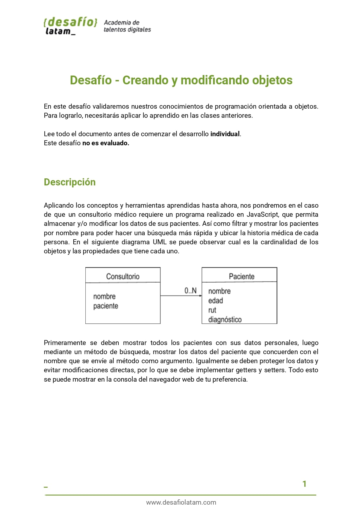
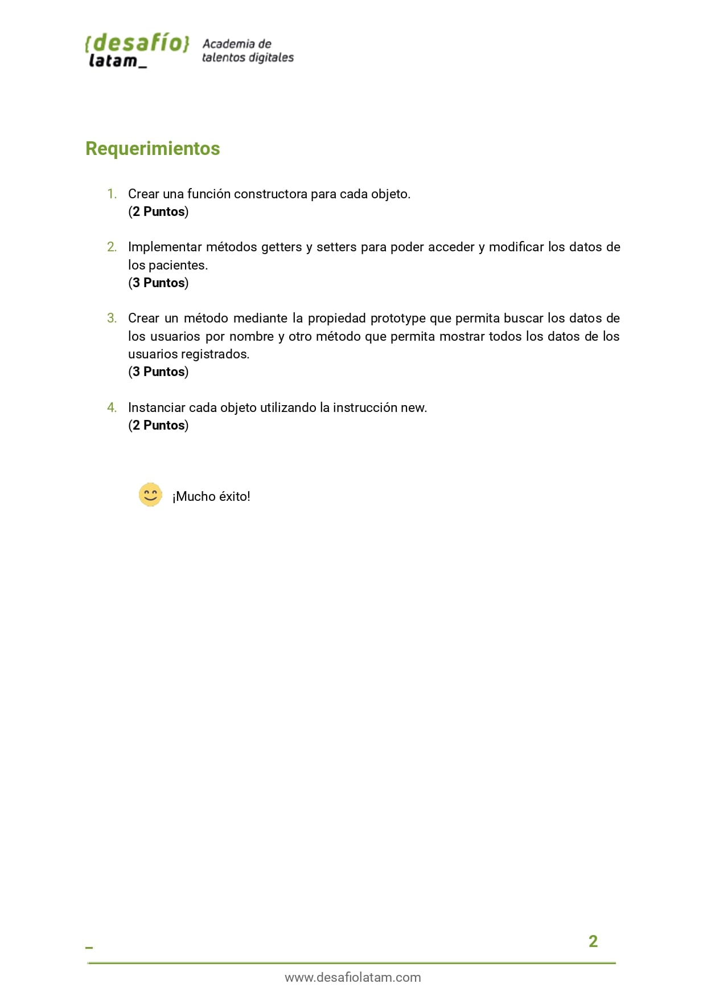
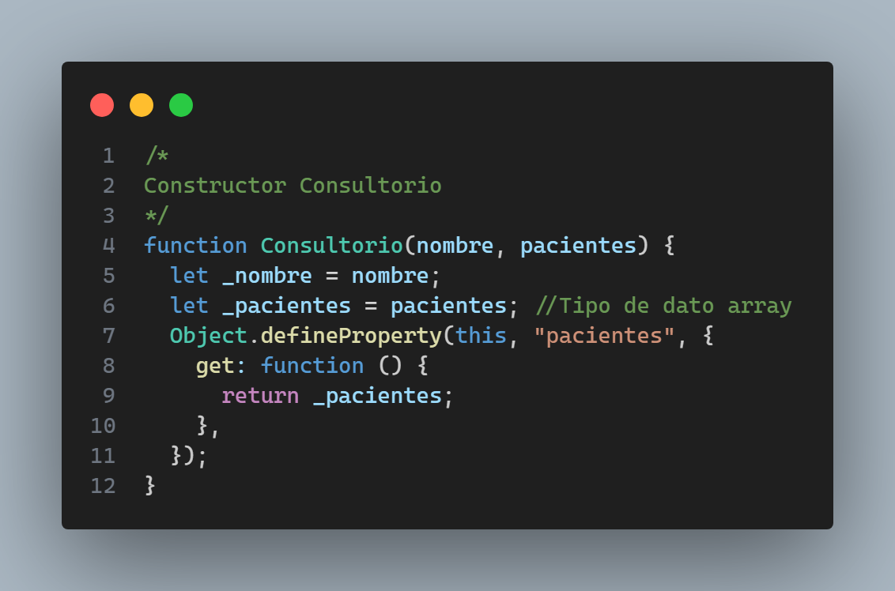
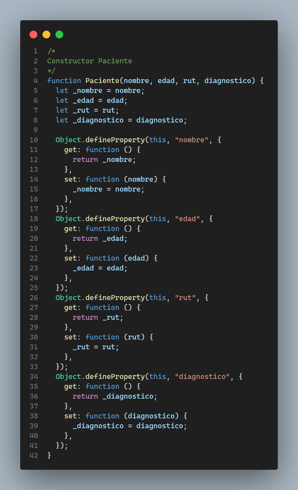
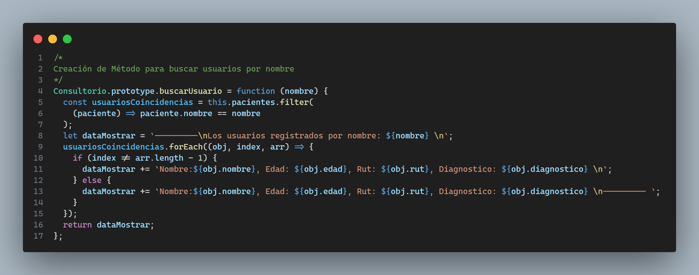
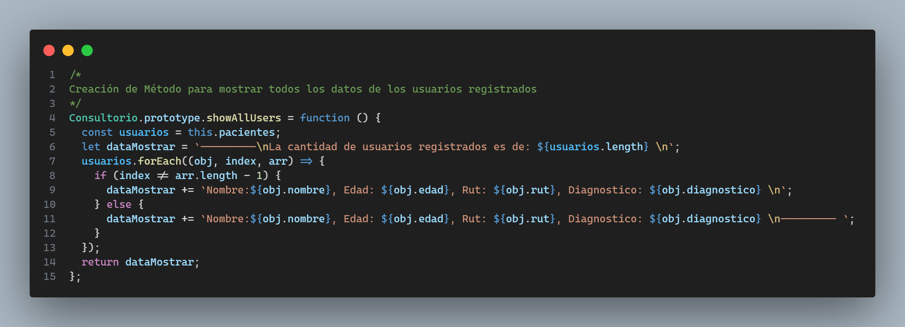
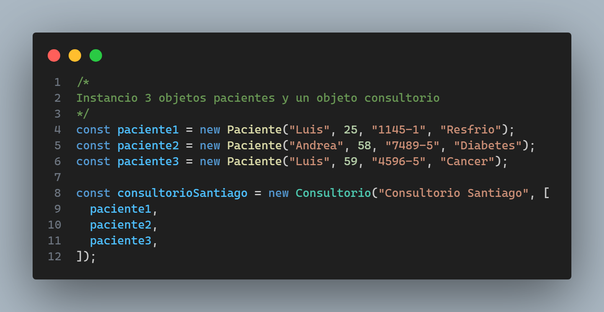
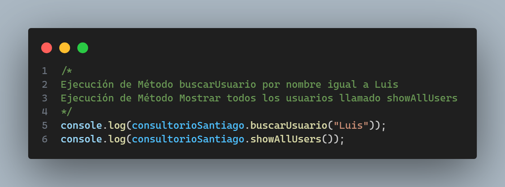
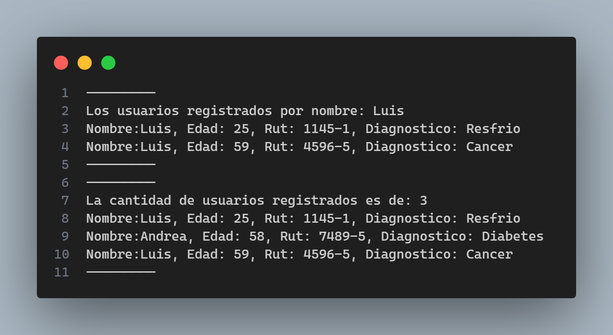

Repositorio con el código del desafío opcional llamado **Desafío - Creando y modificando objetos** perteneciente al módulo 4: **Programación avanzada en JavaScript** de la beca **Desarrollo de aplicaciones Full Stack Javascript Trainee** dictada por Desafío Latam.

Los requsitos del desafío son los siguientes:

A continuación explico mis soluciones a cada ejercicio:

## Ejercicio 1 y 2

El ejercicio 1 me pide **crear funciones constructoras para cada objeto** y el ejercicio 2 me pide **implementar métodos getters y setters para poder acceder y modificar los datos de
los pacientes**. A continuación muestro el código con el cual he creado la función constructora para el Consultorio:

A continuación muestro el código con el cual he creado la función constructora para los Pacientes junto con la creación de getters y setters para acceder o establecer las variables locales definidas al instanciar la función:

## Ejercicio 3

El ejericio 3 me pide dos cosas: **Crear un método mediante la propiedad prototype que permita buscar los datos de los usuarios por nombre** y **Crear otro método que permita mostrar todos los datos de los usuarios registrados**:

El método para buscar los datos de los usuarios en base al nombre es el siguiente:

El método para mostrar los datos de todos los usuarios es el siguiente:

## Ejercicio 4

Se me pide **Instanciar cada objeto utilizando la instrucción new** para lo cual he creado el siguiente código:

Además, he utilizado los métodos definidos en mi solución del ejercicio 3:

El resultado de la llamada de dichos métodos se imprime en consola mostrando lo siguiente:

